# 🚀 Flutter Online Açık Artırma Sistemi

Bu proje, **Flutter** ve **Firebase** kullanılarak geliştirilmiş bir **online açık artırma** uygulamasıdır. 📱  

Kullanıcılar, uygulama üzerinden:  
- **Ürün ekleyebilir** 🏷 
- **Gerçek zamanlı olarak teklif verebilir** 💰  
- **Açık artırmaların bitiş süresini takip edebilir** ⏳ 
- **Kazanan kişi otomatik belirlenir** 🎉 

Firebase'in **Firestore ve Authentication** servisleri kullanılarak **gerçek zamanlı senkronizasyon** sağlanmıştır.  
Bu sayede, her kullanıcı güncel teklifleri **anlık olarak** görebilir.  

---


## 📷 Ekran Görüntüleri  

| 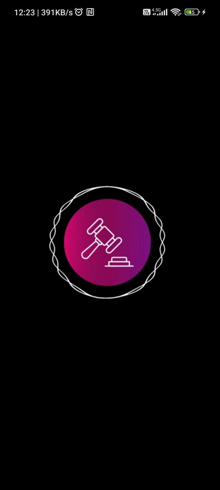 | 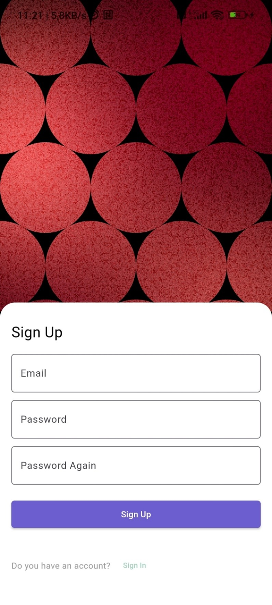 | 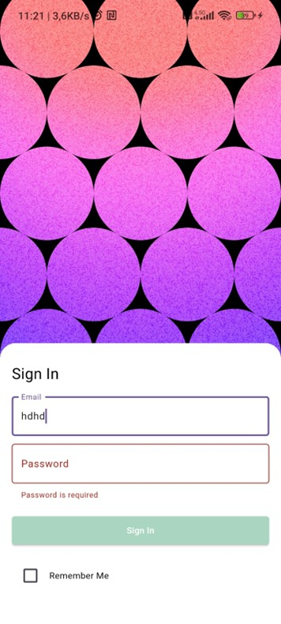 |  
|---|---|---|  
| 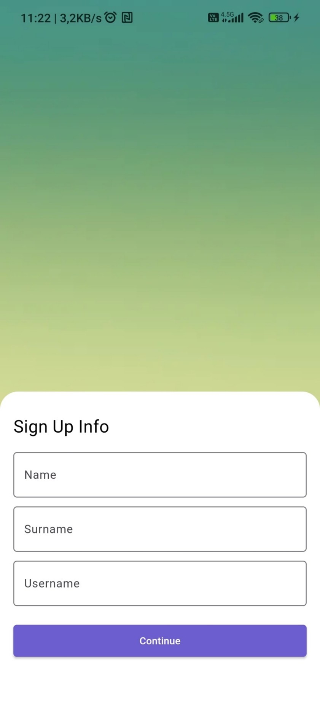 | 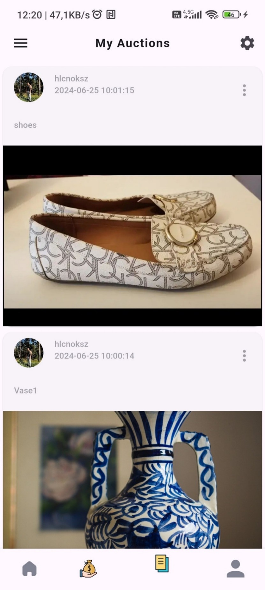 | 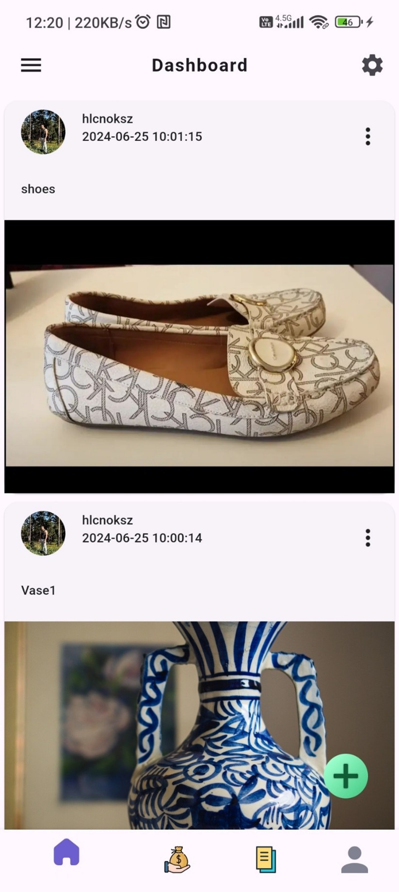 |  
| 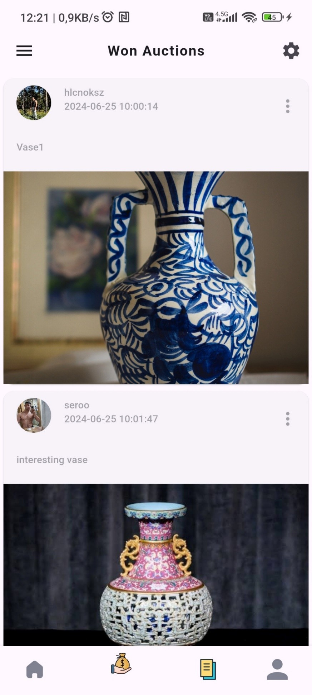 |  | 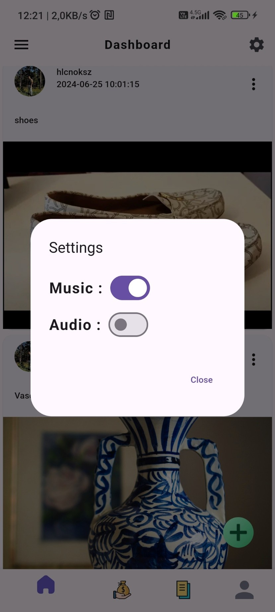 |  
| 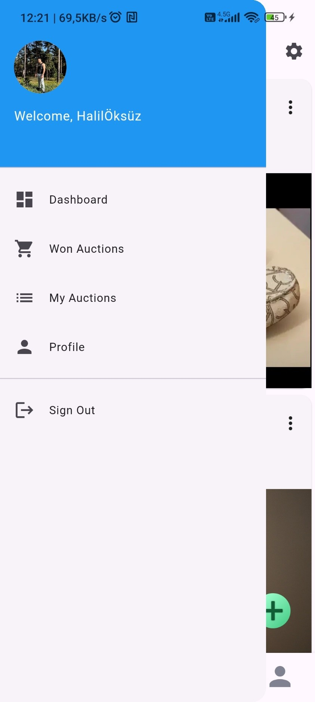 | 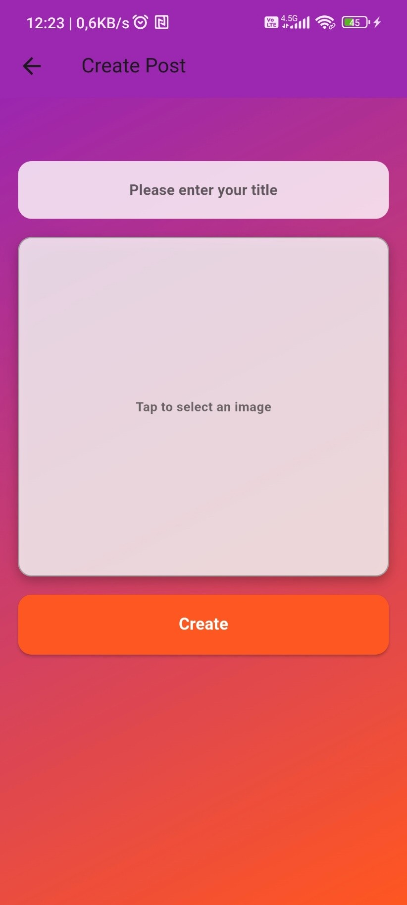 | 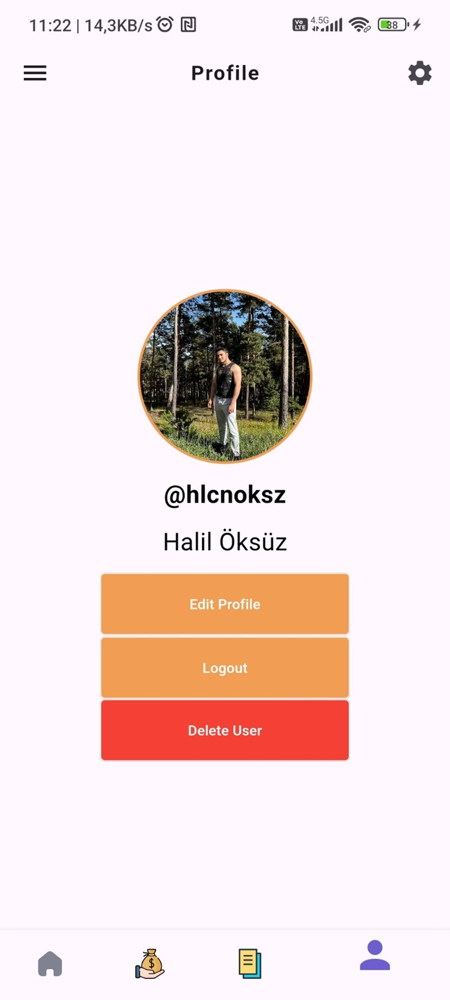 |  
| 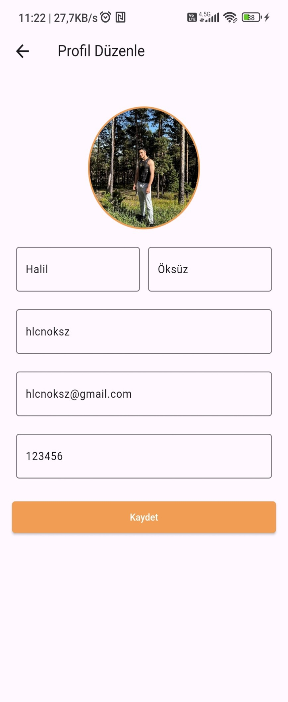 | 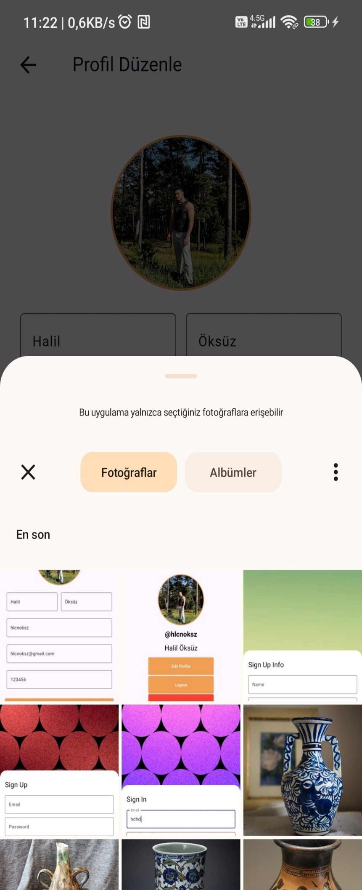 | 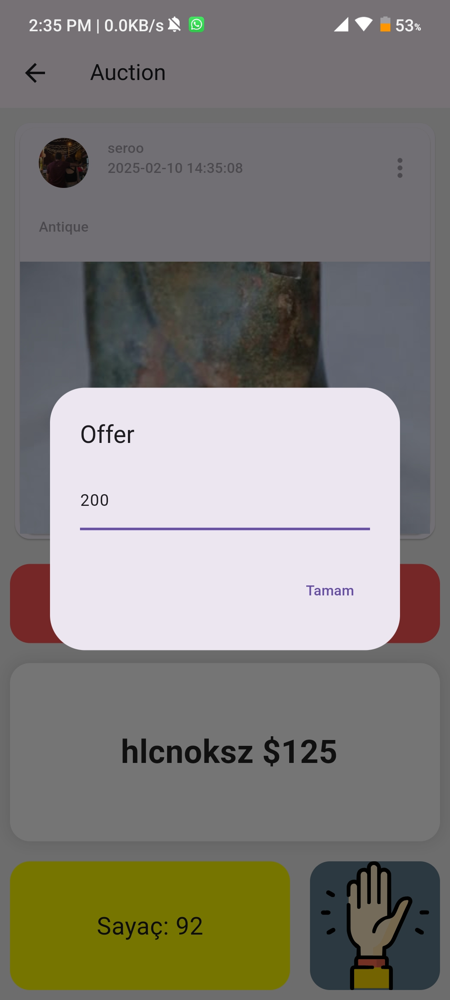 |  
| 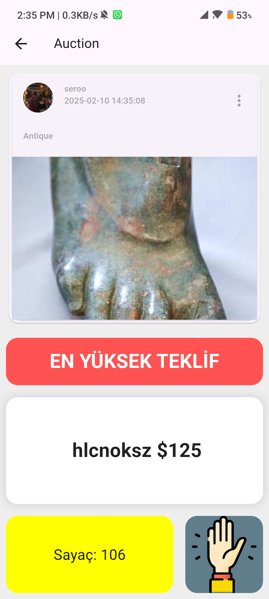 |  


## 📦 Kurulum

1. **Projeyi klonla**  
   ```sh
   git clone https://github.com/halilcanoksuz66/Online-Auction-System.git
   cd Online-Auction-System
   ```

2. **Gerekli paketleri yükle**  
   ```sh
   flutter pub get
   ```

3. **Uygulamayı çalıştır**  
   ```sh
   flutter run
   ```

## 📚 Kullanılan Teknolojiler
- Flutter
- Dart
- Firebase

## ✨ Özellikler
✅ Kullanıcı girişi  
✅ Gerçek zamanlı veri senkronizasyonu  
✅ Offline destek  

## 🛠 Geliştirme Süreci
Bu projede şunlar yapıldı:
- [x] UI tasarımı tamamlandı
- [x] Firebase entegrasyonu yapıldı
- [ ] Dark mode eklenecek (Yakında!)

**📩 İletişim**

Eğer herhangi bir sorunuz veya geri bildiriminiz varsa, benimle iletişime geçmekten çekinmeyin!

